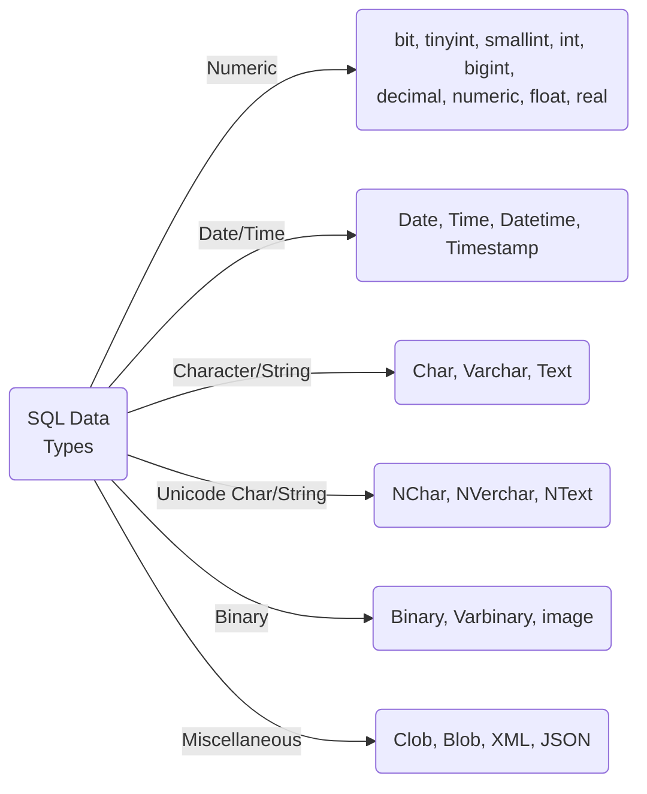

# SQL - Summary 

## SQL-Basics
- DDL - Data Defenition Language
- DML - Data Manipulation Language
- DRL - Data Retrieval Language
- DCL - Data Controll Language
___
## SQL-Commands
### Data Retrieval
__SELECT__
```sql
-- Return all entries from table `customers`
SELECT * FROM customers
```
```sql
-- Return only the `orders`-column from table `customers`
SELECT orders FROM customers
```
__SELECT DISTINCT__
```sql
-- Return every unique entry of the column `zipCode` from table `customers`
SELECT DISTINCT zipCode FROM customers
```
__WHERE__
```sql
-- Return all entries from table `customers` where colummn `zipCode` is set to `4840`
SELECT * FROM customers WHERE zipCode = 4840
```
__HAVING__
```sql
-- Use the `HAVING`-keyword, when using aggregate functions like `COUNT()` in what would be
-- the `WHERE` statement
SELECT * FROM customers HAVING COUNT(orders) > 1
```
__AND / OR / NOT__
```sql
-- Default AND (&&), OR (||) and NOT (!) operators.
-- use brackets when needed! 
-- e.g. `... WHERE (col1 = case1 AND col2 = case2) OR col3 = case3`
SELECT * FROM customers WHERE paid = 1 AND inProgress = 1
```
```sql
SELECT * FROM customers WHERE zipCode = 4840 OR zipCode = 4850
```
```sql
SELECT * FROM customers WHERE country = 'AUT' AND NOT city = 'VIE'
```
__NULL / NOT NULL__
```sql
-- To check if the cell-value is or is not `null`, use the following commands 
SELECT * FROM orders WHERE orderDate IS NULL
```
```sql
SELECT * FROM orders WHERE orderDate IS NOT NULL
```
__AS / Aliases__
```sql
-- Assign the column `id` the name `customerNumber` in the current query. 
-- Can be used in WHERE-clauses, JOINS, etc.
SELECT id AS customerNumber FROM customers
```
```sql
-- Special case: parent-table and 2 ids in 2 columns that belong to 1 other table.
-- To differentiate between the two columns, aliases can be used.
-- ... 
LEFT JOIN typeTable AS typeA ON creatures.typeID1 = typeA.id
LEFT JOIN typeTable AS typeB ON creatures.typeID2 = typeB.id
-- ...
```
```sql
-- Creating a new column with a calculated result
SELECT workers, hours, workers*workhours AS hoursTotal FROM employees
```
__GROUP__
```sql
-- Similar to `SELECT DISTINCT`, however, the `GROUP`-keyword returns the 
-- entire row of the result, while `SELECT DISTINCT` only returns the one column
-- that is provided in `SELECT DISTINCT searchColumn`
SELECT * FROM customers GROUP BY age
```
__ORDER BY__
```sql
-- Returns all entries from the table `customers` and orders it 
-- ascending (A-Z, 0-9) by age
SELECT * FROM customers ORDER BY age ASC
```
```sql
-- Returns all entries from the table `customers` and orders it 
-- descending (Z-A, 9-0) by age
SELECT * FROM customers ORDER BY age DESC
```
__LIMIT / TOP__
```sql
-- Returns the first 10 results of the result-set
-- SQLServer, MS-Access
SELECT TOP 10 FROM customers
```
```sql
-- MySQL
SELECT * FROM customers LIMIT 10
```
__LIKE & Wildcards__
```sql
-- To search for patterns, use `LIKE` instead of `=`
-- Returns all customers where the column `name` starts with `A`
SELECT * FROM customers WHERE name LIKE 'A%'
```
```sql
-- Returns all customers where the column `name` doesn't end with `A`
SELECT * FROM customers WHERE name NOT LIKE '%A'
```
```sql
-- Returns all customers where the column `name` contains `A`
SELECT * FROM customers WHERE name LIKE '%A%'
```

```sql
-- Returns all customers where the column `name` contains a `d` at the third position
SELECT * FROM customers WHERE name LIKE '%__d'
```
__IN__
```sql
-- Same as:
--`... WHERE zipCode = 4840 OR zipCode = 4850 OR zipCode = 4860`
SELECT * FROM customers WHERE zipCode IN (4840,4850,4860)
```
__EXISTS__
```sql
-- Tests if a fitting entry is found in a sub-query
SELECT SupplierName FROM Suppliers  
WHERE  EXISTS (
	SELECT ProductName FROM  Products 
	WHERE Products.SupplierID = Suppliers.supplierID AND Price < 20);
```
__BETWEEN__
```sql
-- Return all entries from table `customers` where the age is between 18 and 21
SELECT * FROM customers WHERE age BETWEEN 18 AND 21
```
__CASE__
```sql
-- Advanced usage. Set a new columns value depending on the tested columns value
SELECT orderID, quantity,  
CASE  
	WHEN quantity > 30  THEN  "The quantity is greater than 30"  
	WHEN quantity = 30  THEN  "The quantity is 30"  
	ELSE  "The quantity is under 30"  
END AS quantityText  
FROM orderDetails;
```
__INNER JOIN__
```sql
-- Returns the table `customers` linked to the table `countries`.
-- Only returns a result, if value in joined column exist 
SELECT * FROM customers 
INNER JOIN countries ON customers.countryID = countries.id
```
__LEFT JOIN__
```sql
-- Returns the table `customers` linked to the table `orders`.
-- Returns a result, even if the value in the joined column does not exist 
SELECT * FROM customers
LEFT JOIN orders ON customers.id = orders.customerID
```
__RIGHT JOIN__
```sql
-- Returns the table `customers` linked to the table `orders`.
-- Returns a result, even if the value in the joined column does not exist 
-- Same as `LEFT JOIN` with flipped assignments
SELECT * FROM customers
RIGHT JOIN orders ON orders.customerID = customers.id
```
__FULL OUTER JOIN__
```sql
-- Returns all entries from both the `customers`-table as well as the `orders`-table
-- Joins them if possible, otherwise leaves the un-joinable parts blank
SELECT * FROM customers 
FULL OUTER JOIN orders ON customers.id = orders.customerID
```
__UNION ALL__
```sql
-- Returns a combined result set of the tables `customers` and `suppliers`.
-- Both tables in the UNION must have the same column amount and names (Use aliases if needed)
-- Returns all values with duplicate entries
SELECT city FROM customers
UNION ALL
SELECT city FROM suppliers
```

__UNION DISTINCT__
```sql
-- Returns all values without duplicate entries
SELECT city FROM customers
UNION DISTINCT
SELECT city FROM suppliers
```

### Data Manipulation

__INSERT__
```sql
-- Add a new entry to the table `customers`
INSERT INTO customers (firstname, lastname) VALUES ('Tom','Hamston')
```
__UPDATE__
```sql
-- Changes one or more cells/rows in the table
UPDATE cusomters SET age = 20 WHERE id = 652
```
```sql
-- Change multiple cells at once
UPDATE cusomters SET age = 20, lastname = 'Orthwild' WHERE id = 652
```
__DELETE__
```sql
-- Delete a row from the table
DELETE FROM customers WHERE id = 54
```
__SELECT INTO__
```sql
-- Copies the table `customers` into the table `customersBackUp`
SELECT * INTO customersBackUp FROM customers
```
__INSERT INTO SELECT__
```sql
-- Copies all entries from the table `customers` into the table `customersUnderAge`,
-- where the column `age` is lower than 18
INSERT INTO customersUnderAge
SELECT * FROM customers WHERE age < 18
```

### Data Definition

__CREATE__
```sql
-- Creates a new table with 3 columns (numeric, text, text)
CREATE TABLE customers (
	id int,
	firstname varchar(100),
	lastname varchar(100)
)
```
__DROP__
```sql
-- Deletes the table `customers`
DROP TABLE customers
```
__TRUNCATE__
```sql
-- Clears the table `customers`
TRUNCATE TABLE customers
```
__ALTER__
```sql
-- Adds an extra column to the table `customers`
ALTER TABLE customers ADD email varchar(200)
```
```sql
-- Removes the column `email` from table `customers` 
ALTER TABLE customers DROP COLUMN email
```
```sql
-- Change the datatype of column `email` from table `customers`
ALTER TABLE customers ALTER COLUMN email varchar(250)
```
__BACKUP__
```sql
-- Saves the database
BACKUP DATABASE dbName TO DISK = 'filepath'
```
```sql
-- Saves only the changes since the last full backup
BACKUP DATABASE dbName TO DISK = 'filepath' WITH DIFFERENTIAL
```
__CONSTRAINTS__
```sql
-- Adding constraints (= regulations, conditions, ...) to the columns 
-- when creating a new table
CREATE TABLE customers (
	id int PRIMARY KEY,
	firstname varchar(100) NOT NULL,
	lastname varchar(100) NOT NULL,
	email varchar(150) UNIQUE
	age int CHECK(age > 0)
	active boolean DEFAULT 1
)
```
```sql
NOT NULL	-- Can not save a `null` value
UNIQUE		-- Inserted value must be unique within the column
PRIMARY KEY	-- Setting primary key of the table
FOREIGN KEY	-- Setting foreign key
CHECK		-- Adds a condition to the column
DEFAULT		-- Sets the default-value when inserting into table (if not specified at insert)
INDEX		-- Created an index on the column
```
___
## SQL Datatypes
Main Datatypes in SQL:

___

## SQL Formats

### Date Formats
- DATE:  `YYYY-MM-DD`
- DATETIME: `YYYY-MM-DD HH:NN:SS 
___
### Date Inserts in MS-Access
MS-Access can't auto-convert text to dates. To work with dates in MS-Access, use the following syntax:

Date: 1999-11-16 2:25:53
In MS-Access: `#1999-11-16 2:25:53#` (or `#'1999-11-16 2:25:53'#`)
___
